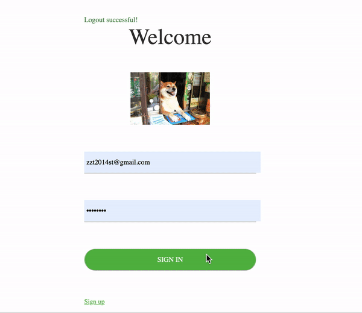

# README

    迷你记事本
    

#### 如何clone项目

    git clone https://github.com/tangyuan1808/to-do-list.git
    
### 如何设置环境

##### Mac 用户

* Install Ruby(rbenv is the ruby manager)

        brew install rbenv        
        echo 'eval "$(rbenv init -)"' > ~/.bash_profile
        source ~/.bash_profile
        rbenv install 2.6.2
        
* Install Bundler(ruby package manager)
        
        gem install bundler -v 2.0.1
        bundle
                
* Set up database(sqlite)
        
        bundle exec rake db:migrate
        
* Start application server         

        bundle exec rails s
        
##### 其他用户

    请使用Docker

#### 如何运行测试

* Set up test database

        RAILS_ENV=test bundle exec rake db:migrate     

* Run unit test(rspec) 

        bundle exec rspec
        
* Run feature test(cucumber), only support chrome 75
        
        bundle exec cucumber

#### Docker

* Build Docker Image

        docker build -t to-do-list .

* Run application using docker

        docker run --rm -p 3000:3000 to-do-list

* Run test using docker 
 
        docker run --rm -t to-do-list bundle exec rspec 
    
                 
#### 技术堆栈

    Ruby 2.6.2
    Rails 5.2.3
    cucumber 
    rspec 
    sqlite
        
         
